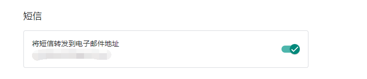
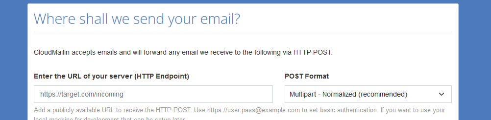
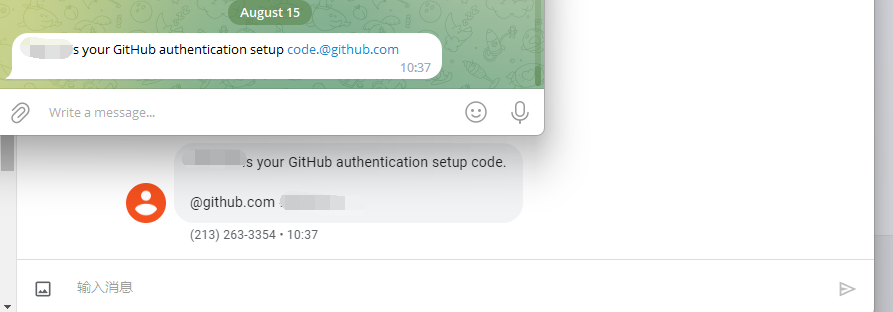

## Google Voice to telegram.

将google voice上收到的短信转发到telegram，从而避免打开网页或app收验证码。

### 使用方法

#### 1.Google Voice配置转发。


#### 2.配置wrangler.toml

填入自己的telegrambotid,chatId,且定义一个path防止别人调用。

AUTH需要设置为true来确认gmail的转发。

```toml
[vars]
TELEGRAM_TOKEN="aaaa"
TELEGRAM_USER_ID="bbbb"
PATH="/cccddeeffefeff"
AUTH="true"
```

#### 3.上传

```bash
wrangler dev
```

记录下workers的地址,如`gv2telegram.xxx.workers.dev`加上自定义path

#### 4.配置cloudmailin

https://www.cloudmailin.com/



POST Format选择JSON Normalized.

#### 5.Gmail配置转发

先把cloudmailin的email填写进去。然后确认转发的邮件全文会发送到你的telegram。

输入确认码。

设置Gmail将所有标题中包含“新短信”的转发到这个邮箱。

保存即可

#### 6.重新部署

将auth改回false，

```bash
wrangler dev
```

即可。

### 效果



可以自己给自己发几条消息测试）

